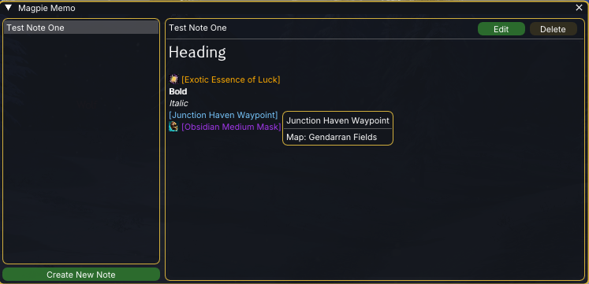
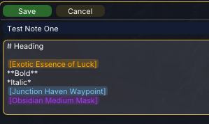

# Magpie Memo

A notepad addon for Guild Wars 2 (Raidcore Nexus). Keep multiple notes of markdown text with Guild Wars 2 chat links embedded inline as rich "chips" — icon, name, and tooltip — right where you wrote them. Named for the bird that collects shiny things.

## AI Notice

This addon has been largely created using Claude. I understand that some folks have a moral, financial or political objection to creating software using an LLM. I just wanted to make a useful tool for the GW2 community, and this was the only way I could do it.

If an LLM creating software upsets you, then perhaps this repo isn't for you. Move on, and enjoy your day.

## Screenshots




## Features

- **Multiple notes**, two-pane: titles on the left, the selected note on the right. Create, rename, and delete.
- **Markdown** in the rendered view: bold, italic, headings, and bullet lists. Edit mode shows the raw source.
- **View / edit modes** with a distinct edit tint, Save / Cancel, and an unsaved-changes prompt so edits are never lost.
- **Chat-link chips** — paste any GW2 chat link (waypoint, item, skin, skill, build) into a note and it becomes an inline chip:
  - Shows the item's **icon and name** with a rich hover **tooltip** — item stats, rarity, flavour text and rune/sigil bonuses, skill facts, waypoint map, and full **recipe** breakdowns (ingredients, required rating, and the crafted item).
  - **Right-click** a chip to **Copy chat code** or **Open in wiki**.
  - Build links show their spec automatically (e.g. `[Mirage Build]`).
- **Works with or without [Decoder Ring](https://github.com/PieOrCake/decoder_ring)**: with it loaded, chips show full names and icons; without it, chips fall back to basic labels and the copy / wiki actions still work. Nothing breaks if it loads or unloads mid-session.

## Install

Build produces `MagpieMemo.dll`. Copy it into your Guild Wars 2 `addons` folder. Toggle the window with the quick-access shortcut or `CTRL+SHIFT+M`.

## Building

Cross-compiled to a Windows DLL from Linux with MinGW:

```
cmake -S . -B build && cmake --build build      # -> build/MagpieMemo.dll
```

Host-side unit tests for the pure logic (note model, markdown parser, codec, chip round-trip, icon-URL helpers):

```
cmake -S . -B build-host -DMAGPIE_HOST_TESTS=ON && cmake --build build-host && ./build-host/magpie_host_tests
```
